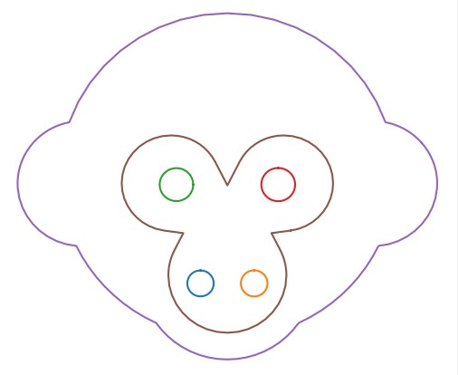
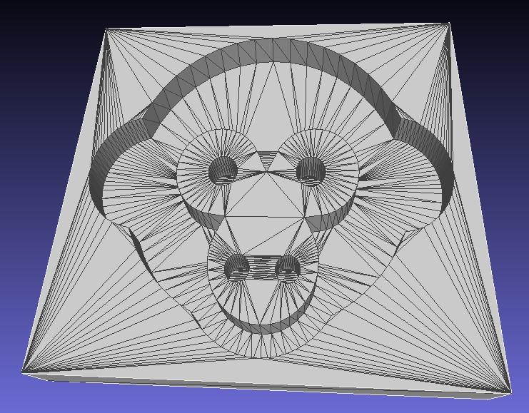
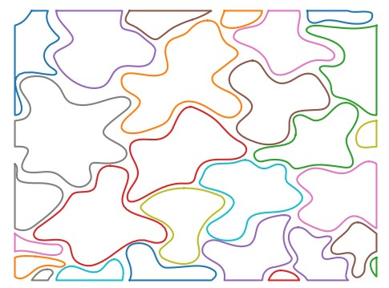
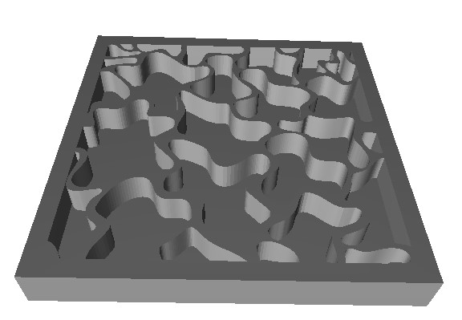
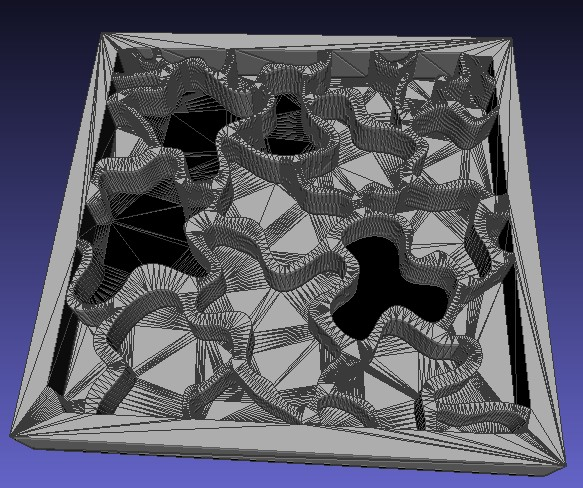

## Cadquery: SVG -> 3D Tile
This codebase is not structured as a python package.  
You will need a solid understanding of cadquery.  
The majority of the code uses the Direct API.    

With that said, the command line usage is simple.  
If you can get a cadquery environment working 😖.  
I recommend using a vscode dev-container.  

Dependencies:
```
cadquery
shapely
git+https://github.com/RaubCamaioni/svgpath.git
matplotlib (debug/view svgpath output)
```

## Command Line Usage

I recommend using a simple SVG.  
Highly complex SVGs take a long time to process.  
Cadquery can drop faces depending on the structure of the SVG.  

Confirm svgpath properly loads SVG.
```
python -m svgpath.plot -i patterns/monkey.svg
```


Create 3D tile STL file with the following command.  
The output is expecting a stl_files folder to put the output.
```
python src/svg_grid.py -i patterns/monkey.svg
```
You can view the output in you browser with the viewer.html  
Meshlab, Flashprint, CQ-editor  
The viewer.html has best STL interpretor in my experience.

Meshlab output with faces shown.


## Another Example Output

Blobs: viewer.html used  
Holes are present in meshlab render.  
  
  
